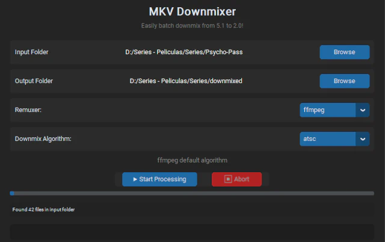

# MKV Downmixer

Simple python app to batch downmix audio (5.1 -> 2.0) in movies while retaining or even boosting voice volume.

 ### Requirements
 + python 3.9+
 + ffmpeg and ffprobe in path – environment variable – from [ffmpeg](https://ffmpeg.org/download.html)
 + mkvmerge (optional, but recommended) in path – environment variable – from [mkvtoolnix](https://mkvtoolnix.download/downloads.html)
